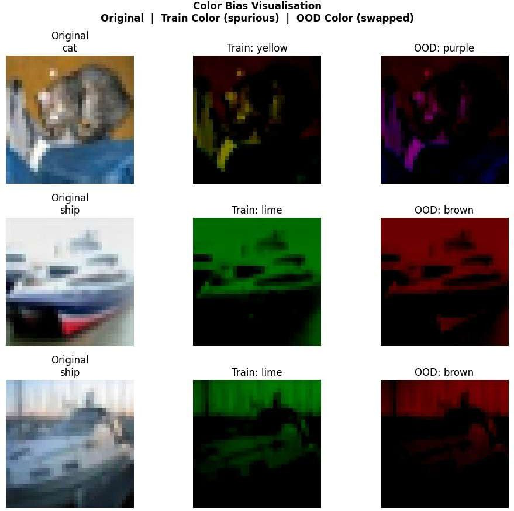
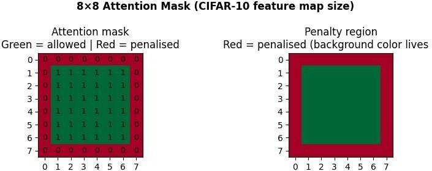
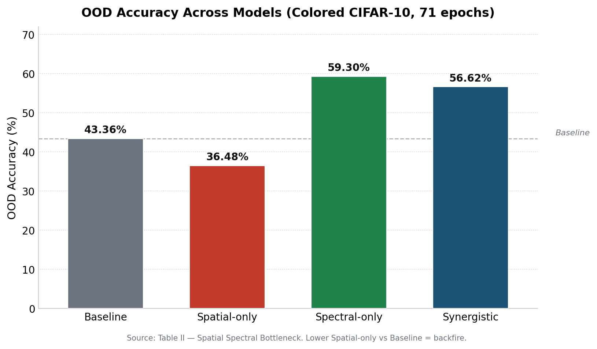

# The Spatial-Spectral Bottleneck 🎯

**How Local Attention Constraints Amplify Color Shortcuts in Convolutional Neural Networks**


> Spatial attention is supposed to stop CNNs from cheating with background shortcuts. We show it can make the cheating *worse* — by pushing the shortcut into a different channel entirely.

---

## TL;DR

We trained four identical CNNs on a color-biased version of CIFAR-10 and tested them on data where every color mapping is scrambled. Constraining the network's **spatial** attention (where it looks) backfired — accuracy dropped and color reliance *increased* — because the network simply rerouted the shortcut through its **spectral** (color) pathway instead. Directly constraining color reliance, on the other hand, worked.

| | |
|---|---|
| 🧪 **4** model variants ablated | 🎯 **56.61 pp** train/OOD accuracy gap in baseline |
| 🖼️ **60,000** images (Colored CIFAR-10) | 📉 **−6.88 pp** OOD accuracy from spatial-only "fix" |
| 🔁 **71** epochs to convergence | 📈 **+15.94 pp** OOD accuracy from spectral-only fix |
| 🌈 **10** spuriously-colored classes | 🎨 **6.71%** lowest color confusion achieved |

---

## Table of Contents

- [The Problem](#the-problem)
- [The Finding](#the-finding)
- [Results](#results)
- [Method](#method)
- [Dataset Construction](#dataset-construction)
- [Repo Structure](#repo-structure)
- [Getting Started](#getting-started)
- [Reproducibility](#reproducibility)
- [Citation](#citation)
- [Authors](#authors)
- [License](#license)

---

## The Problem

CNNs are excellent at finding *some* correlation that predicts the label — even when that correlation is texture, background, or color rather than the actual object. The conventional fix is spatial attention regularization: penalize activation in border regions, force focus onto the object-centric foreground, and assume the shortcut is closed off.

Nobody had tested what happens when the shortcut isn't spatially localized in the first place.



*Each row: original CIFAR-10 image → training version with spurious color applied (α=0.3) → OOD version with the color mapping permuted. The object signal is deliberately weakened relative to the color overlay.*

## The Finding

We call it the **Spatial-Spectral Bottleneck**: spatial and spectral shortcut pathways are *inversely coupled*. Close off one, and the network routes around it through the other.

- Spatial masking **worked exactly as designed** — border activation dropped from `0.136 → 0.059`.
- But OOD accuracy **fell** (`43.36% → 36.48%`) and color confusion **rose** (`26.19% → 30.29%`).
- The network didn't stop shortcut learning. It relocated it.



*The spatial attention mask applied to conv2 feature maps. Green (inner 6×6) is permitted; red border pixels are penalised — this is exactly where background color concentrates after two max-pooling operations on 32×32 inputs.*

## Results

Four CNNs, identical architecture, different loss constraints — trained for 71 epochs on Colored CIFAR-10 with a fixed seed (42).

| Model | λ_spatial | λ_color | Train Acc | OOD Acc | OOD Δ vs Baseline | Color Confused | Train Time |
|---|---|---|---|---|---|---|---|
| Baseline CNN | 0.0 | 0.0 | 99.97% | 43.36% | — | 26.19% | 1076.9s |
| Spatial-only | 1.0 | 0.0 | 99.84% | 36.48% | 🔻 −6.88 pp | 30.29% | 1099.6s |
| Spectral-only | 0.0 | 2.5 | 99.80% | **59.30%** | 🟢 +15.94 pp | **6.71%** | 1612.2s |
| Synergistic | 1.0 | 2.5 | 99.68% | 56.62% | 🟢 +13.26 pp | 6.86% | 1640.8s |



**Takeaways:**
- 🥇 **Spectral-only** is the strongest single-axis fix — the color pathway is the dominant shortcut channel, not the spatial one.
- ⚠️ **Spatial-only is a genuine regression** relative to doing nothing.
- 🤝 **Synergistic** (both constraints) closes both pathways at once and is the theoretically complete fix — its slight underperformance vs. spectral-only appears to be a resolution artifact of 32×32 images, where background color saturates the *entire* frame, not just the border (see paper §VII-B).

## Method

- **Shared architecture:** 2 conv blocks (3→32→64 channels, 3×3 kernels, ReLU + MaxPool) → 2 FC layers (4096→256→10)
- **Classification loss:** standard cross-entropy
- **Spatial attention penalty:** 8×8 binary mask on conv2 feature maps — outer 1px border penalized, inner 6×6 permitted
- **Spectral (KL color invariance) loss:** RGB-channel-shuffled version of each batch; KL divergence between original and shuffled output distributions minimized (temperature τ=2.0)
- **Optimizer:** Adam, lr=1e-3, batch size 128, 71 epochs, seed=42 (PyTorch/NumPy/Python, deterministic CUDNN)

## Dataset Construction

**Colored CIFAR-10** — a CIFAR-10 variant purpose-built to isolate color shortcuts:

- 50,000 train / 10,000 test images, 10 classes, 32×32 resolution
- Each class assigned a unique spurious background color (`p_bias = 0.98`)
- Object signal suppressed via pixel intensity scaling (`α = 0.3`) before color injection
- **OOD test set:** all class→color mappings rotated by one position, so every test image carries the *wrong* color for its class

## Repo Structure

```
.
├── data/                  # Colored CIFAR-10 construction scripts
├── models/                # Shared CNN architecture
├── losses/                # Spatial attention penalty + KL color invariance loss
├── train.py               # Training loop for all 4 ablation configs
├── evaluate.py             # OOD accuracy + color reliance probe
├── configs/                # λ_s / λ_c hyperparameter configs per model
├── notebooks/              # Grad-CAM visualizations, result plots
├── assets/                 # Figures used in this README
└── paper/                  # Full paper (PDF)
```

> Adjust this section to match your actual file layout before publishing.

## Getting Started

```bash
git clone https://github.com/hemangjg/spatial-spectral-bottleneck.git
cd spatial-spectral-bottleneck
pip install -r requirements.txt

# Build the Colored CIFAR-10 dataset
python data/build_colored_cifar.py

# Train all four ablation models
python train.py --config configs/baseline.yaml
python train.py --config configs/spatial_only.yaml
python train.py --config configs/spectral_only.yaml
python train.py --config configs/synergistic.yaml

# Evaluate OOD accuracy + color reliance
python evaluate.py --checkpoint checkpoints/synergistic.pt
```

## Reproducibility

All experiments use a fixed random seed (`42`) across PyTorch, NumPy, and Python's `random` module, with deterministic CUDNN settings. All four models are trained on identical data orderings and identical weight initialization, so results are directly comparable.

## Citation

If you use this work, please cite:

```bibtex
@article{kazmi2026spatialspectral,
  title={The Spatial Spectral Bottleneck: How Local Attention Constraints Amplify Color Shortcuts in Convolutional Neural Networks},
  author={Kazmi, Sarim and Jhamnani, Aditya and Tolani, Monica and Gyanchandani, Gunjan and Ganjsinghani, Hemang},
  institution={Thadomal Shahani Engineering College, University of Mumbai},
  year={2026}
}
```

## Authors

- **Sarim Kazmi** — sarimkaz175@gmail.com
- **Aditya Jhamnani** — adityajhamnani@gmail.com
- **Dr. Monica Tolani** — monica.tolani@thadomal.org
- **Gunjan Gyanchandani** — gunjan.gyanchandani9@gmail.com
- **Hemang Ganjsinghani** — hemangjg@gmail.com | [LinkedIn](https://www.linkedin.com/in/hemang-ganjsinghani/)

Department of Artificial Intelligence and Data Science, Thadomal Shahani Engineering College, University of Mumbai

## License

This project is licensed under the [MIT License](LICENSE) — permissive, allows reuse with attribution, and is the standard choice for open research code. Swap this out if your institution or co-authors require something stricter (e.g. Apache 2.0 for patent grant language, or a non-commercial license if you plan to pursue publication rights that restrict reuse).
